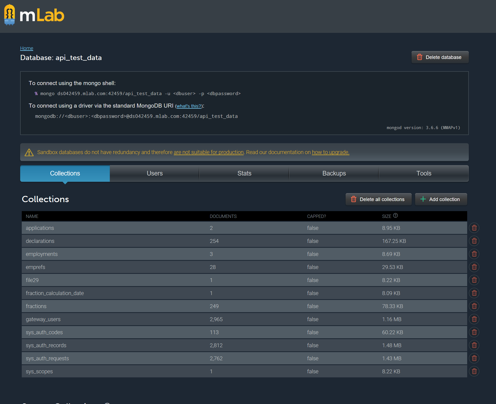

# Digital Apprenticeships Service

## Employer Apprenticeship Service

|               |               |
| ------------- | ------------- |
||Employer Apprenticeship Service|

## Levy Declarations

### Purpose
This page describes:

-  How levy declarations are loaded into the system
-  How the HMRC system is used in tests
-  How test data is created 

> At the time of writing the solution is switching from cloud services to app services, so worker roles will become web jobs for example.  
     
# How levy declarations are loaded into the system

### An `EmployerRefreshLevyQueueMessage` is posted to service bus for every account and PAYE Ref

- Once a month (at about 16:00 on the 20th day) a web job called `SFA.DAS.EAS.LevyAccountUpdater.WebJob` is kicked off. 
- This job runs `AccountUpdater.RunUpdate` which gets all Accounts into memory and for each account fetches all PAYE schemes.
- An `EmployerRefreshLevyQueueMessage` message is posted to service bus for each account id and PAYE scheme ref. 

### A constantly running worker role subscribes to a topic containing `EmployerRefreshLevyQueueMessage`

- The worker role `SFA.DAS.EAS.LevyDeclarationProvider.Worker` uses our `MessageSubscriberFactory` pattern to subscribe to a topic named ` MA_LevyDeclaration`.
- Each `EmployerRefreshLevyQueueMessage` message received is used to update the database
 
### How each message is processed
 
- English Fractions for the PAYE ref are obtained from the HMRC and merged into the database.
- Levy Declarations for the PAYE ref are obtained from the HMRC. We only ask for Levy Declarations that are submitted since the last submission we have already. This date is obtained from stored proc `[employer_financial].[GetLastLevyDeclarations_ByEmpRef]`). If this is the first levy declaration then only levy declarations since the 01-Apr-2017 are fetched (this date is hard-wired into the HmrcService).The supplied data is adapted in a couple of ways:
	- Duplicate submissions are removed from the data supplied by HMRC. This is done based on submisson ID and if duplicates are found one of the duplicates will be arbitrarily selected. _I do not know what the justification for this is_. 
	- `LevyDueYtd` is nulled out for all declarations where `NoPaymentForPeriod` is true
	- Any Levy Declarations for period 12 with a date more than 21 days after the start of period 12 are considered to be "year end adjustments" - they are not explicitly declared as such by the HMRC. Any such year end adjustments are exposed to a special process.
	- ... more to come

# How the HMRC system is used in tests

There is not a test system provided by the HMRC. Instead, a fake HMRC has been created by the SFA, which is hosted externally on `https://das-alpha-hmrc-api-mock.herokuapp.com/apprenticeship-levy`. This system is written in Scala, the source code to which is available [https://github.com/](https://github.com/UKGovernmentBEIS/das-alpha-hmrc-api-mock "here"). This is a fairly thin layer that fronts a managed Mongo database (hosted at MLabs). There is some functionality but this is limited to enforcing token-based authentication and filtering on the document collections. 

# How test data is created

Test data is held in a Mongo database, hosted at [mlabs](https://mlab.com/databases/api_test_data "MLabs"). You will need an account to access this. 

Collection Name                 | Need to populate?| Description
--------------------------------| :-------------:  |------------------------------
applications                    | No               | Used by token provider - you won't need to modify this
declarations                    | Yes              | This is the only collection that needs to be populated to support the levy run
employments                     | No               | This is used by the employment check and is not relevant to the levy declarations
emprefs                         | No               | This does not need to be populated for the levy declaration job
file29                          | No               | No idea what this is
fraction_calcation_date         | No               | This does not need to be populated for the levy declaration job 
fractions                       | No               | This does not need to be populated for the levy declaration job
gateway_users                   | No               | This is used to provide the HMRC PAYE ref logins. This does not need to be populated for the levy declaration job

So you can see that `declarations` is the only collection that is relevant to Levy Declarations.

Here is an example document:

`[JSON]
{
    "_id": {
        "$oid": "5b8908c3fb6fc04af68dcb28"
    },
    "empref": "001/IG00700",
    "declarations": [
        {
            "id": 2393376202,
            "submissionTime": "2018-05-18T15:17:20.000",
            "payrollPeriod": {
                "year": "17-18",
                "month": 12
            },
            "levyDueYTD": 29900,
            "levyAllowanceForFullYear": 15000
        },
        {
            "id": 2345823562,
            "submissionTime": "2018-04-18T12:07:20.000",
            "payrollPeriod": {
                "year": "17-18",
                "month": 11
            },
            "levyDueYTD": 27531,
            "levyAllowanceForFullYear": 15000
        },
        {
            "id": 2291180172,
            "submissionTime": "2018-03-16T16:26:58.000",
            "payrollPeriod": {
                "year": "17-18",
                "month": 11
            },
            "levyDueYTD": 25018,
            "levyAllowanceForFullYear": 15000
        },
        {
            "id": 2252348912,
            "submissionTime": "2018-02-16T12:17:30.000",
            "payrollPeriod": {
                "year": "17-18",
                "month": 10
            },
            "levyDueYTD": 5686,
            "levyAllowanceForFullYear": 15000
        },
        {
            "id": 2153157282,
            "submissionTime": "2017-11-29T13:47:50.000",
            "payrollPeriod": {
                "year": "17-18",
                "month": 8
            },
            "levyDueYTD": 16818,
            "levyAllowanceForFullYear": 15000
        }
    ]
}
`

Note the following:
- empref and declarations are the only properties you need to set when creating a document - _id will be created automatically
- properties are case sensitive (this is normal for NoSQL databases). 
- note that the collection will be filtered on submissionTime - if you use different casing for submissionTime (e.g. you create a document with properties named SubmissionTime or submissiontime for example) then the document will never be presented to you via the fake API (as the array is filtered on submissionTime which will be null if you used a different casing).

