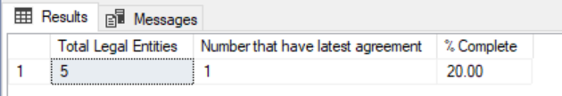

# Digital Apprenticeships Service

## Employer Apprenticeship Service

|               |               |
| ------------- | ------------- |
||Employer Apprenticeship Service|

## Generate Agreements Job

### Purpose

This job will generate an employer agreement for all legal entities/accounts which are not already linked to the latest agreement.  

## How does it achieve this?

### In English...

It finds the latest agreement template Id and then scans the database looking for all legal entities that do not already have this agreement (whether signed or not). For each legal entity it finds it will create an agreement, generating an Agreement Created event. 

### In Nerd...

The class GenerateAgreementsIdProvider will identify the latest agreement using the IEmployerAgreementRepository.GetLatestAgreementTemplate() method. It will then return batches of legal entity ids that do not already have this agreement using the method ILegalEntityRepository.GetLegalEntitiesWithoutSpecificAgreement. Each legal entity id found is passed to GenerateAgreementsIdProcessor.DoAsync(...) method which will then find all accounts linked to the legal entity#1 and for each legal entity and account combination it will invoke the CreateEmployerAgreementCommand which, in turn, will call EmployerAgreementRepository.CreateEmployerAgreeement. This will do the usual stuff when an agreement is created, including raising the appropriate event to create the task.

## How do I run this

Post an ad-hoc job message specifying a job name of **GenerateAgreementsJob**. See [Running Jobs](RunningJobs.md "Running jobs")

## I'm worried - how can I tell what it's doing?

In the words of *Darth Vader*

> I find your lack of faith disturbing...

That aside, the following messages will be written to [Kibana](https://dev-elk.fasst.org.uk/login?next=%2Fapp%2Fkibana#?_g=(), "Kibana logs").

    Starting processing of accounts GenerateAgreementsIdProvider
    
    Finished processing for GenerateAgreementsIdProvider (some additional stats and information will be logged as well)

There are no intervening log messages unless something fails.

## Can I check in the database if something is happening?

You can run the following query. 

```sql
SET TRANSACTION ISOLATION LEVEL READ UNCOMMITTED
BEGIN TRANSACTION
    DECLARE @latestTemplateId INT = (SELECT TOP 1 Id FROM employer_account.EmployerAgreementTemplate ORDER BY VersionNumber DESC)

    SELECT 
        Total as [Total Legal Entities],
        Done AS [Number that have latest agreement],
        CONVERT(DECIMAL(6,2), CONVERT(DECIMAL(6,2), Done) / CONVERT(DECIMAL(6,2), Total) * 100) AS [% Complete]
    FROM (
        SELECT
            COUNT(1) AS Total,
            COUNT(d.Id) AS Done
        FROM (
            SELECT ea.AccountId, ea.LegalEntityId
            FROM employer_account.EmployerAgreement ea
            WHERE ea.StatusId <> 5
            AND ea.TemplateId <> @latestTemplateId
            GROUP BY ea.AccountId, ea.LegalEntityId
        ) t
        OUTER APPLY (
            SELECT ea2.Id
            FROM employer_account.EmployerAgreement ea2
            WHERE ea2.AccountId = t.AccountId
            AND ea2.LegalEntityId = t.LegalEntityId
            AND StatusId <> 5
            AND ea2.TemplateId = @latestTemplateId
        ) d
    ) c
COMMIT TRANSACTION
```

The above sql will generate a result that looks like this:



Hopefully you will see the percentage go up over time!

----------

/#1 okay, in reality the application does not support a legal entity belonging to more than one account. However, the database does and the code must match the database.

