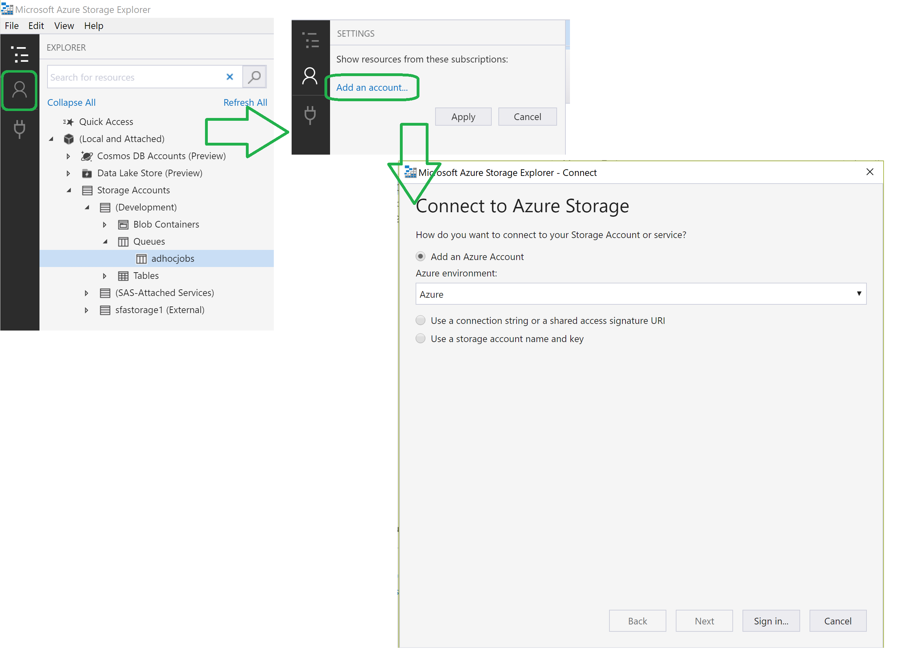
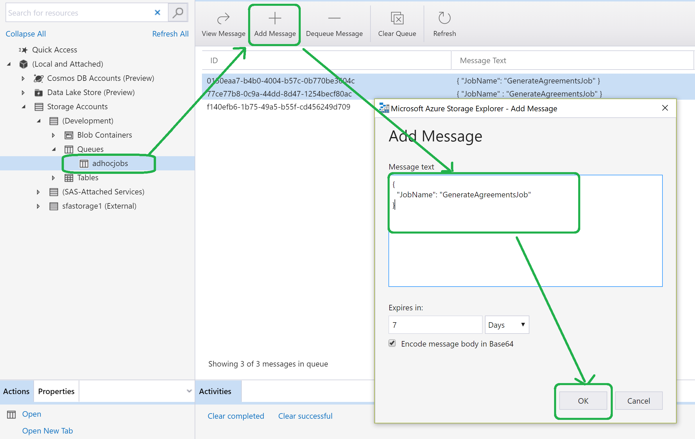

# Digital Apprenticeships Service

## Employer Apprenticeship Service

|               |               |
| ------------- | ------------- |
||Employer Apprenticeship Service|

## Running Jobs

### Purpose
This page describes running the style of web job used by EAS that are based on Azure WebJob API rather than the old style, which was based on creating CLIs that ran on the cloud service VM.  

### Which jobs are the new style?

New style jobs are classes that implement the IJob interface.

Job Name                        | Set for automatic run?          | Description
--------------------------------|     :-------------:             |------------------------------
PaymentIntegrityCheckerJob      | Yes - 05:30 1st of each month   |
UpdateAccountPublicHashedIdsJob | No                              |
GenerateAgreementsJob           | No                              |[Generate Agreements](GenerateAgreements.md "Generate Agreements")
ListRecentActivity              | No                              |
ListTriggeredJobs               | No                              |
   

### Which jobs are old style?

Old style jobs have a dedicated CLI.

# How do I execute a new style job?

The new style jobs may have a dedicated 'trigger' that causes it to run automatically. For example, on a timer basis or in response to posting a message to a queue. However, any job may be invoked manually by posting a message to a specific queue named adhocjobs (see below).

#Running a Job Manually

> The objective here is to get a message into the queue named **adhocjobs** in the storage account used by the **SFA.DAS.EAS.Account.Worker** worker role.
 

You will need a tool such as [Microsoft Azure Storage Explorer](https://azure.microsoft.com/en-us/features/storage-explorer/ "Microsoft Azure Storage Explorer") that allows you to post messages to [Azure Storage Queues](https://azure.microsoft.com/en-gb/services/storage/queues "Azure Storage Queue"). The following screen shots will reference Microsoft Azure Storage Explorer.
 

##Connect the tool to the  required storage account

##Open the Queues container in the relevant storage account 

The json message is posted to a queue named adhocjobs and is structured as follows:

    
    {
      "JobName": "GenerateAgreementsJob"
    }
    

The value chosen for JobName, which is not case sensitive, must be the name of a .net class (without the namespace prefix) that implements the IJob interface.
 
Once the message is posted to the queue it should disappear from the queue relatively quickly (anything from almost immediately up to a minute or so). A message disappears from the queue when it has been picked up by the worker role hosting the web job and it is being processed.
 

**If the message does not disappear from the queue:**

- check the storage account the message was added to is the same storage account that is being monitored by the **SFA.DAS.EAS.Account.Worker** worker role.
- check that the worker role is running

**If the message appears in the adhocjobs_deadletter queue**

- the message has caused a run time exception and could not be processed. Check Kibana for error messages.

 
**If the message disappears and does not appear in the dead letter queue but the job does not appear to do anything**

- check that the correct job name was specified
- check the Kibana logs for errors
     

## Specific Jobs Details

* [Generate Agreements](GenerateAgreements.md "Generate Agreements")
